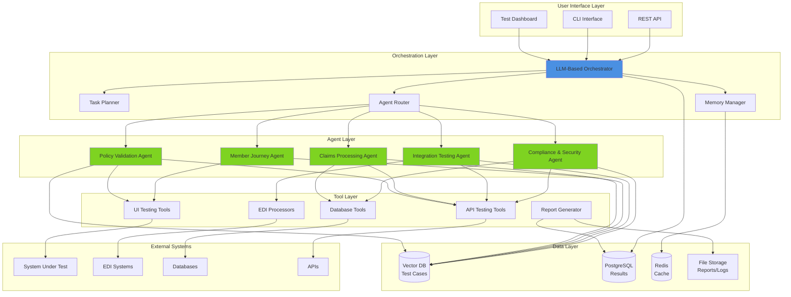
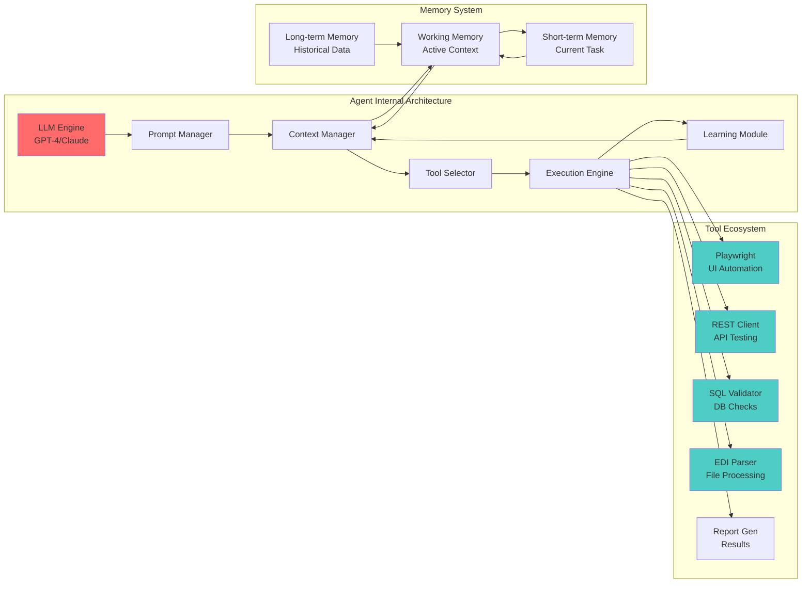
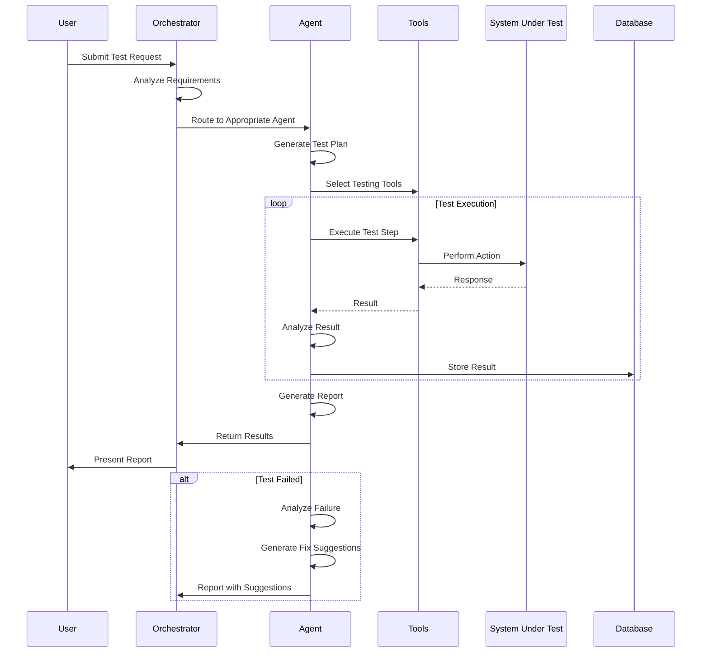
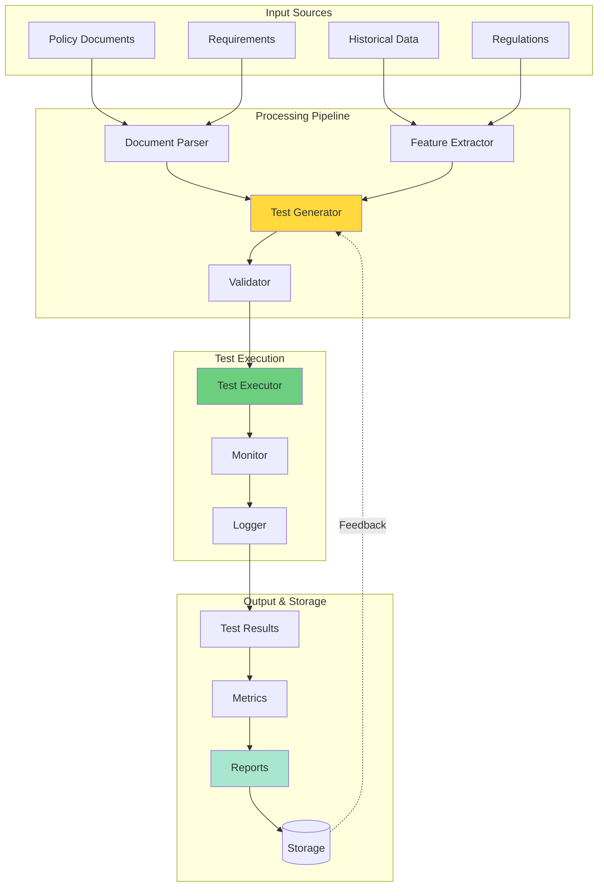
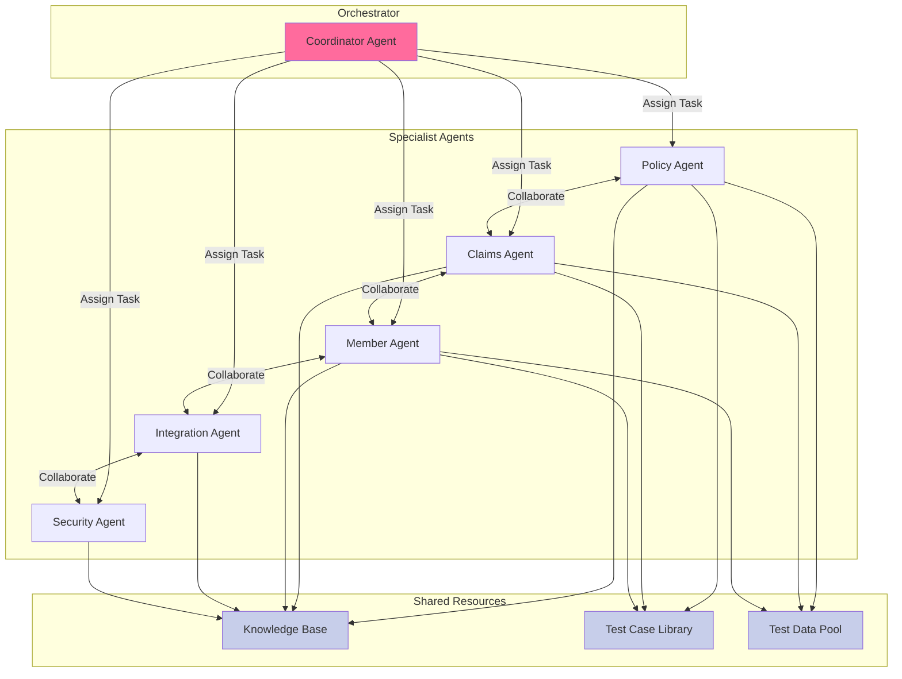
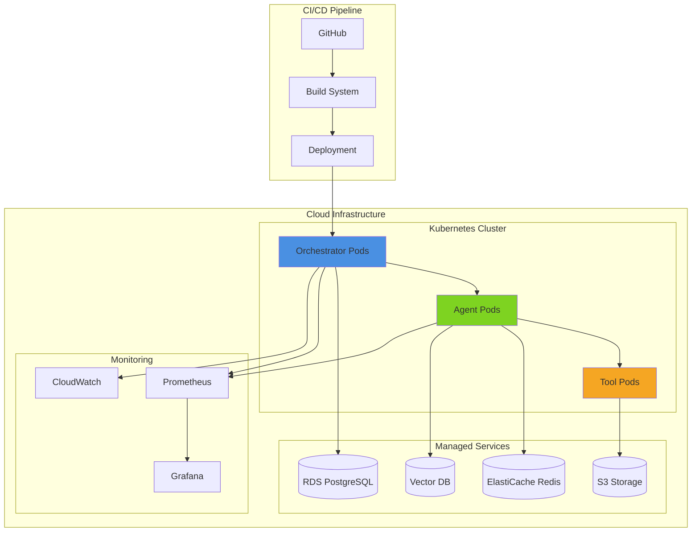

# Agentic Testing Framework - Architecture Diagram

## High-Level Architecture

## Detailed Component Architecture

## Test Execution Flow

## Data Flow Architecture

## Agent Collaboration Model

## Deployment Architecture

## How to View These Diagrams

These diagrams use Mermaid syntax and can be viewed in:
1. **GitHub** - Automatically renders Mermaid diagrams
2. **VS Code** - Install "Markdown Preview Mermaid Support" extension
3. **Online** - Use [Mermaid Live Editor](https://mermaid.live/)
4. **Documentation Sites** - GitBook, Docusaurus, MkDocs support Mermaid

## Architecture Highlights

### Scalability
- Horizontal scaling of agent pods
- Distributed test execution
- Load balancing across agents

### Reliability
- Fault-tolerant agent design
- Automatic retry mechanisms
- Health monitoring and alerting

### Security
- Encrypted data at rest and in transit
- Role-based access control
- Audit logging for all operations

### Performance
- Parallel test execution
- Caching layer for frequent operations
- Optimized database queries